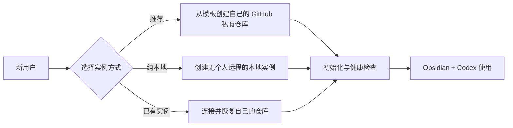

# KnowledgeHub 通用落地包

这个仓库面向第一次采用 KnowledgeHub 的其他用户，提供可安装的 Codex Skill、自动部署脚本和人工说明。每位用户创建并拥有自己的知识库实例；公开框架仓库只提供结构、规则和工具，不保存用户资料。



## 推荐方式：让 Codex 引导落地

```powershell
git clone https://github.com/MaybeToSure/KnowledgeHub-Setup.git "$env:USERPROFILE\KnowledgeHub-Setup"
powershell -ExecutionPolicy Bypass -File "$env:USERPROFILE\KnowledgeHub-Setup\install-skill.ps1"
```

重新启动 Codex 或新建任务，然后说：

```text
使用 $knowledge-hub-setup 帮我创建一套属于我自己的 KnowledgeHub。
```

Codex 会询问实例保存位置，以及是否创建用户自己的 GitHub 私有仓库。

## 不安装 Skill，直接执行

### 创建用户自己的 GitHub 私有实例（推荐）

先安装并登录 GitHub CLI，然后运行：

```powershell
powershell -ExecutionPolicy Bypass -File `
  "$env:USERPROFILE\KnowledgeHub-Setup\knowledge-hub-setup\scripts\setup-knowledgehub.ps1" `
  -Mode GitHub `
  -Destination "$env:USERPROFILE\Documents\KnowledgeHub" `
  -GitHubRepository <你的GitHub账号>/<你的知识库仓库名>
```

脚本使用公开模板创建一个新的私有仓库；新仓库及其中资料归执行者自己所有。

### 创建纯本地实例

```powershell
powershell -ExecutionPolicy Bypass -File `
  "$env:USERPROFILE\KnowledgeHub-Setup\knowledge-hub-setup\scripts\setup-knowledgehub.ps1" `
  -Mode Local `
  -Destination "$env:USERPROFILE\Documents\KnowledgeHub"
```

纯本地模式不会创建个人远程仓库。公开框架远程只保留为只读意义上的 `framework`。

### 使用已有的个人实例

```powershell
powershell -ExecutionPolicy Bypass -File `
  "$env:USERPROFILE\KnowledgeHub-Setup\knowledge-hub-setup\scripts\setup-knowledgehub.ps1" `
  -Mode Existing `
  -Destination "$env:USERPROFILE\Documents\KnowledgeHub" `
  -KnowledgeRepositoryUrl <用户自己的仓库地址>
```

## 前置条件

- Git
- Git LFS
- Codex
- Obsidian
- GitHub CLI：仅 GitHub 模式需要

脚本不会覆盖非空目录，不接受 URL 内嵌凭据，也不会创建公开的个人知识库。完整检查表见 `knowledge-hub-setup/references/adoption-checklist.md`。

框架来源：[KnowledgeHub Framework](https://github.com/MaybeToSure/KnowledgeHub-Framework)。
