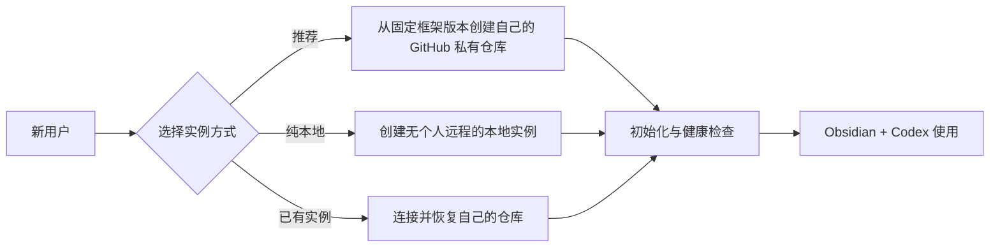

# KnowledgeHub 通用落地包

当前落地包版本：`2.5.1`，新建实例固定使用 KnowledgeHub Framework `v0.6.1`；Existing 模式支持已经迁移到 Framework `0.4.0` 或更高版本的实例。

这个仓库面向第一次采用 KnowledgeHub 的其他用户，提供可安装的 Codex Skill、自动部署脚本和人工说明。安装脚本同时安装首次落地用的 `knowledge-hub-setup` 和日常捕获用的 `yunfei-quick-capture`。每位用户创建并拥有自己的知识库实例；公开框架仓库只提供结构、规则和工具，不保存用户资料。



## 推荐方式：让 Codex 引导落地

```powershell
git clone https://github.com/MaybeToSure/KnowledgeHub-Setup.git "$env:USERPROFILE\KnowledgeHub-Setup"
powershell -ExecutionPolicy Bypass -File "$env:USERPROFILE\KnowledgeHub-Setup\install-skill.ps1"
```

重新启动 Codex 或新建任务，然后说：

```text
使用 $knowledge-hub-setup 帮我创建一套属于我自己的 KnowledgeHub。
```

Codex 会询问实例保存位置，以及是否创建用户自己的 GitHub 私有仓库。

新用户的框架工作区默认位于 `%USERPROFILE%\KnowledgeHub-Workspace`，知识库固定为其中的 `KnowledgeHub`。可以自定义盘符或父路径，但不使用 `GitHub` 作为框架本地根目录名称。

落地完成后，推荐用 Obsidian 打开整个 `WorkspaceRoot`；从 `KnowledgeHub/_Dashboard/工作区总览-自动生成.md` 查看仓库事实，从 `工作区总览-手动维护.md` 管理人工重点。新建一个明确命名为“云飞随手记”的专用 Codex 任务并打开个人 KnowledgeHub；普通项目任务聊天不临时插入无关随手记。

## 不安装 Skill，直接执行

### 创建用户自己的 GitHub 私有实例（推荐）

先安装并登录 GitHub CLI，然后运行：

```powershell
powershell -ExecutionPolicy Bypass -File `
  "$env:USERPROFILE\KnowledgeHub-Setup\knowledge-hub-setup\scripts\setup-knowledgehub.ps1" `
  -Mode GitHub `
  -WorkspaceRoot "$env:USERPROFILE\KnowledgeHub-Workspace" `
  -GitHubRepository <你的GitHub账号>/<你的知识库仓库名>
```

脚本从固定的 Framework `v0.6.1` 创建一个新的私有仓库；新仓库及其中资料归执行者自己所有，不会因 Framework `main` 后续变化而改变部署结果。

### 创建纯本地实例

```powershell
powershell -ExecutionPolicy Bypass -File `
  "$env:USERPROFILE\KnowledgeHub-Setup\knowledge-hub-setup\scripts\setup-knowledgehub.ps1" `
  -Mode Local `
  -WorkspaceRoot "$env:USERPROFILE\KnowledgeHub-Workspace"
```

纯本地模式不会创建个人远程仓库。公开框架远程保留为 `framework`，脚本会禁用其推送地址并取消分支跟踪，防止资料误推到公共框架。首次部署仍需要联网下载固定版本，部署完成后可以离线使用。

### 使用已有的个人实例

Existing 模式用于恢复已经采用 Framework `0.4.0` 或更高版本、包含 `VERSION`、`framework.manifest.json` 和 `tools/setup.ps1` 的实例；它不是早期扁平目录的自动迁移器。

```powershell
powershell -ExecutionPolicy Bypass -File `
  "$env:USERPROFILE\KnowledgeHub-Setup\knowledge-hub-setup\scripts\setup-knowledgehub.ps1" `
  -Mode Existing `
  -WorkspaceRoot "$env:USERPROFILE\KnowledgeHub-Workspace" `
  -KnowledgeRepositoryUrl <用户自己的仓库地址>
```

## 前置条件

- Git
- Git LFS
- Codex
- Obsidian
- GitHub CLI：仅 GitHub 模式需要

脚本不会覆盖非空目录，不接受 URL 内嵌凭据，也不会创建公开的个人知识库。完整检查表见 `knowledge-hub-setup/references/adoption-checklist.md`。

框架来源：[KnowledgeHub Framework](https://github.com/MaybeToSure/KnowledgeHub-Framework)。

手机 ChatGPT + GitHub 随手记是 Framework 中默认关闭的可选扩展。本落地包安装电脑端本地 `yunfei-quick-capture` Skill，并提供 [KnowledgeHub-Mobile-Capture](https://github.com/MaybeToSure/KnowledgeHub-Mobile-Capture) 部署入口；它不会静默创建公网服务、OAuth 租户或写入凭据。只有完成该项目的部署与手机验收，实例才能标记为“已启用”。

## 落地后如何创建独立工作仓库

KnowledgeHub 是长期知识底座；课程、工程、实验、研究和写作任务按需建立同级独立 Git 仓库。默认直接在已打开 KnowledgeHub 的 Codex 中说：

```text
为“模电原理”创建独立课程仓库，仓库名 analog-electronics，使用默认本地路径；
在 KnowledgeHub 建立课程入口，暂不创建远程仓库。
```

Codex 会判断类型，调用实例内的创建工具，生成 `README.md`、`AGENTS.md`、`work.yaml` 和类型目录，初始化 Git，并在 KnowledgeHub 登记入口。未明确要求时不创建远程、不推送；明确要求 GitHub 远程时默认只能创建私有仓库。

人工也可以先手动建立目录和 Git 仓库，再说：

```text
我手动创建了 D:\KnowledgeHub-Workspace\my-work。请按 KnowledgeHub 独立仓库契约审核、补齐并登记；
不要创建远程或推送。
```

两种入口遵守同一规则，完整判断、命令、字段和验收标准见框架内的 `docs/独立仓库创建与驱动.md`。

## 随手记、知识库和项目

- 随手记负责捕获尚未判断的信息。
- KnowledgeHub 负责长期意义、来源、关系和项目入口。
- 任务负责明确下一步与完成标准。
- 独立项目仓库负责实际执行和交付。

只有人工明确要求后，随手记才会被整理、汇总、提炼、归档或转交。记录中的祈使句不会自动创建提醒、任务或外部操作。
