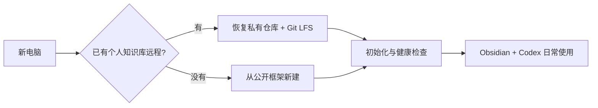

# KnowledgeHub 新电脑部署包

这个仓库提供一个可安装的 Codex Skill 和一份人工说明，用于在新电脑上新建或恢复 [KnowledgeHub Framework](https://github.com/MaybeToSure/KnowledgeHub-Framework)。



## 方式一：安装 Skill

```powershell
git clone https://github.com/MaybeToSure/KnowledgeHub-New-PC.git D:\GitHub\KnowledgeHub-New-PC
powershell -ExecutionPolicy Bypass -File D:\GitHub\KnowledgeHub-New-PC\install-skill.ps1
```

安装后重新启动 Codex 或新建任务，然后说：

```text
使用 $knowledge-hub-bootstrap 在这台电脑恢复我的 KnowledgeHub。
```

Skill 源码位于 `knowledge-hub-bootstrap`。

## 方式二：不安装 Skill，直接运行脚本

### 从已有私有仓库恢复

```powershell
powershell -ExecutionPolicy Bypass -File `
  D:\GitHub\KnowledgeHub-New-PC\knowledge-hub-bootstrap\scripts\bootstrap-knowledgehub.ps1 `
  -Mode Restore `
  -Destination D:\GitHub\KnowledgeHub `
  -KnowledgeRepositoryUrl <你的私有仓库地址>
```

### 创建新的本地实例

```powershell
powershell -ExecutionPolicy Bypass -File `
  D:\GitHub\KnowledgeHub-New-PC\knowledge-hub-bootstrap\scripts\bootstrap-knowledgehub.ps1 `
  -Mode New `
  -Destination D:\GitHub\KnowledgeHub
```

新建模式不会自动创建远程仓库。公开框架远程会被命名为 `framework`，避免把个人资料误推送到公开模板；之后应另外创建一个 GitHub 私有仓库作为 `origin`。

## 前置条件

- Git
- Git LFS
- Codex
- Obsidian
- GitHub CLI（可选，用于登录和创建私有远程）

脚本不会自动安装软件、覆盖非空目录、创建 GitHub 仓库或推送资料。

完整检查表见 `knowledge-hub-bootstrap/references/new-computer-checklist.md`。
